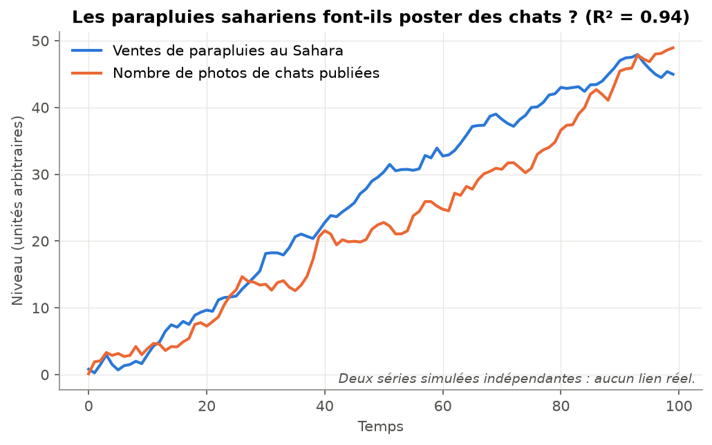
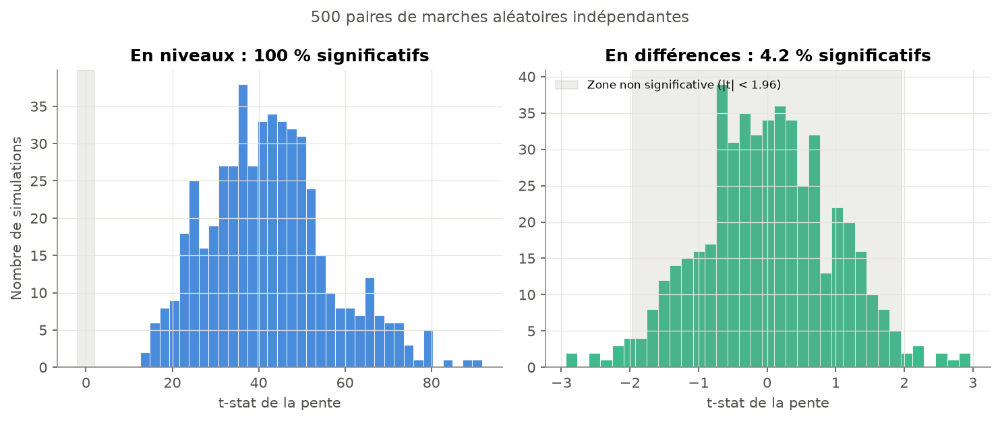
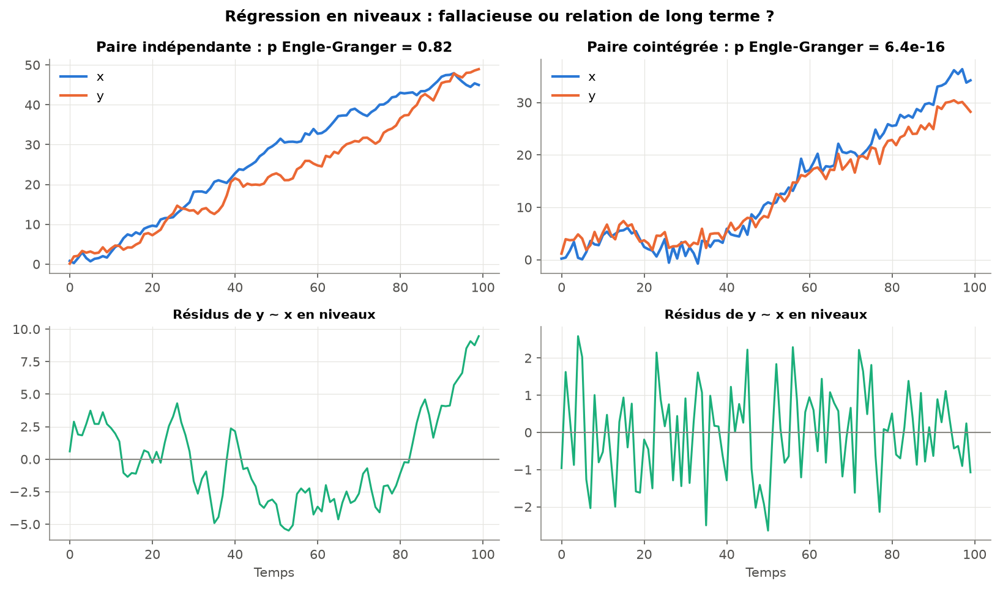
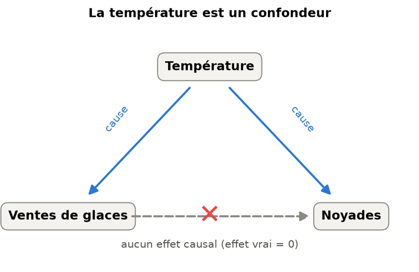
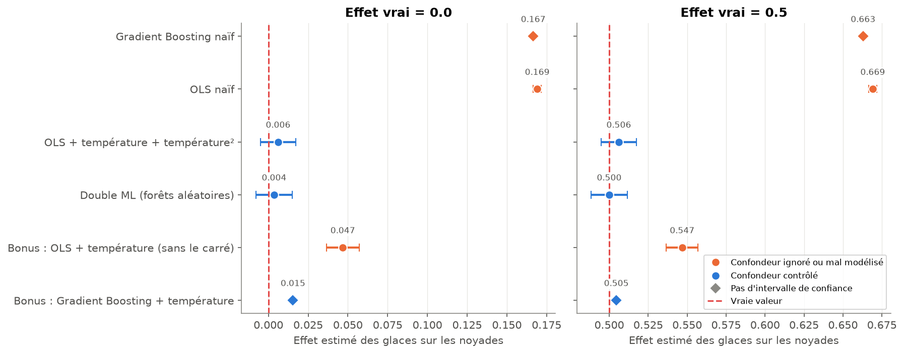
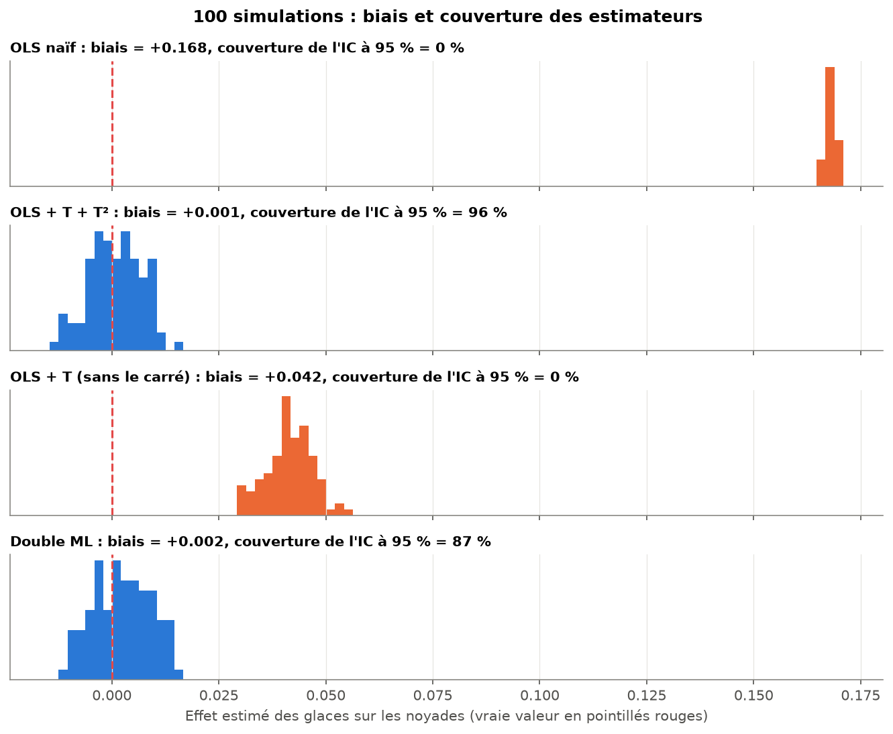
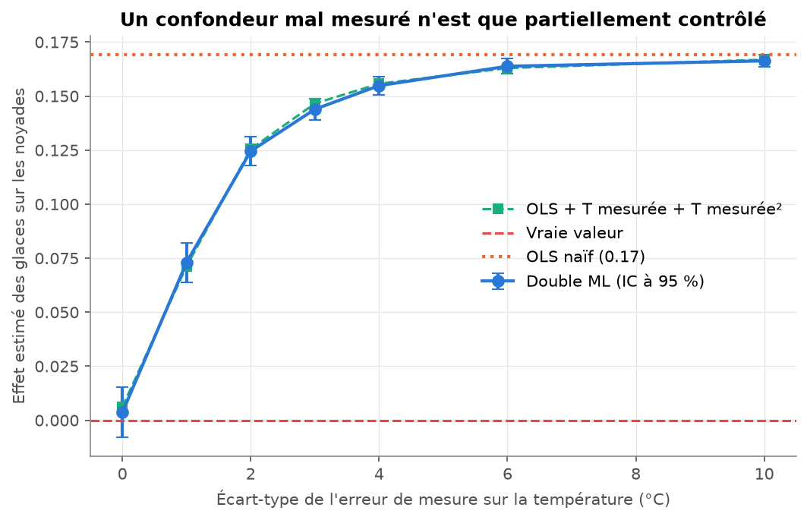
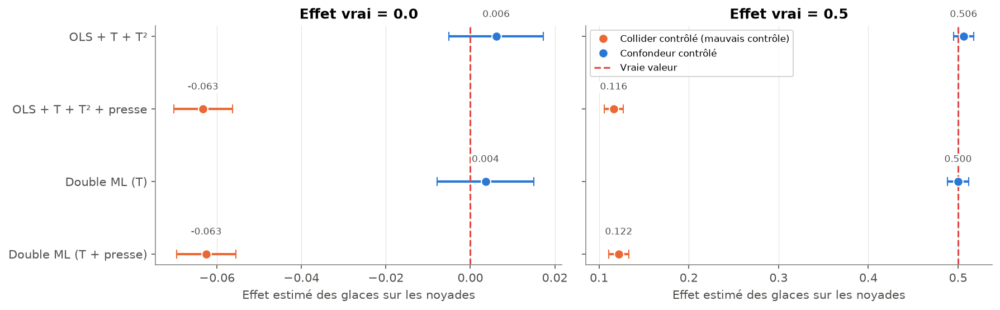

# Corrélation ≠ Causalité : prédire n'est pas expliquer

À partir de données **simulées dont on connaît la vérité**, ce projet montre qu'un modèle de machine learning peut
très bien prédire tout en donnant une mauvaise réponse causale, alors que le contrôle du confondeur (OLS bien
spécifié, Double ML) retrouve le vrai effet. La différence ne vient pas de l'algorithme mais de la question posée :
*prédire Y* n'est pas *mesurer l'effet de X sur Y*.

## 1. Régression fallacieuse : deux séries indépendantes « parfaitement liées »

Deux marches aléatoires indépendantes avec dérive (n = 100) :

| Spécification | Pente | t-stat | p-value | R² | Durbin-Watson |
|---|---|---|---|---|---|
| Niveaux | 0.90 | 39.3 | < 0.001 | **0.94** | 0.11 |
| Différences premières | 0.12 | 0.95 | 0.34 | 0.01 | 1.65 |

Le test ADF ne rejette pas la racine unitaire en niveaux (p = 1.00 et 0.12), mais la rejette en différences
(p < 0.001). Sur 500 simulations, la régression en niveaux est « significative » à 5 % dans **100 %** des cas,
contre **4.2 %** en différences. Sans dérive, ce taux passe de 50 % à 93 % quand n va de 25 à 1 000 : plus de
données n'aide pas.




**Faut-il toujours différencier ? Non.** Deux séries qui suivent la même tendance stochastique sont
**cointégrées**, et leur régression en niveaux est légitime. Le test d'Engle-Granger distingue les deux cas
(p = 0.82 pour la paire fallacieuse, p < 0.001 pour la paire cointégrée). Il n'est cependant pas parfait : sur
300 paires indépendantes, il en déclare 10 % cointégrées au lieu des 5 % attendus.



## 2. Le confondeur : glaces, noyades et température

La température cause à la fois les ventes de glaces et les noyades. Les glaces n'ont **aucun effet** sur les
noyades (n = 5 000).



Le Gradient Boosting naïf (noyades ~ glaces) **prédit bien** (R² = 0.78 en validation croisée) mais conclut
qu'une glace de plus cause 0.17 noyade.

| Méthode | Effet estimé (vrai = 0) | IC 95 % | Effet estimé (vrai = 0.5) | IC 95 % |
|---|---|---|---|---|
| Gradient Boosting naïf | 0.167 | – | 0.663 | – |
| OLS naïf | 0.169 | [0.167 ; 0.172] | 0.669 | [0.667 ; 0.672] |
| OLS + température + température² | 0.006 | [-0.005 ; 0.017] | 0.506 | [0.495 ; 0.517] |
| **Double ML (forêts aléatoires)** | **0.004** | **[-0.008 ; 0.015]** | **0.500** | **[0.488 ; 0.512]** |
| *Bonus : OLS + température sans le carré* | 0.047 | [0.037 ; 0.057] | 0.547 | [0.537 ; 0.557] |
| *Bonus : Gradient Boosting + température* | 0.015 | – | 0.505 | – |



## 3. Robustesse et limites du contrôle

| Question | Résultat |
|---|---|
| **Sur 100 simulations**, les estimateurs sont-ils fiables ? | OLS + T + T² : biais 0.001, couverture de l'IC 96 %. Double ML : biais 0.002, couverture **87 %** (IC un peu trop étroit). OLS naïf : couverture 0 %. |
| **Combien de données** pour le Double ML ? | Biais de 0.05 et couverture de 54 % à n = 200 ; fiable vers n = 2 000 (couverture 96 %). L'OLS bien spécifié est fiable dès n = 200. |
| Et si la température est **mal mesurée** ? | Le biais revient vite : 0.07 dès une erreur de 1 °C, 0.17 (= naïf) avec une erreur de 10 °C. |
| L'**importance des variables** est-elle causale ? | Non. Si la température est mal mesurée, les glaces deviennent la variable la plus importante (1.20 contre 0.04), alors que leur effet est nul. |
| Peut-on **contrôler trop** ? | Oui. Ajouter un collider (articles de presse, causés par les glaces et les noyades) crée un biais : -0.06 au lieu de 0, et 0.12 au lieu de 0.5. |





Les 18 figures sont dans [`figures/`](figures/).

## 4. Ce que ça montre

- **Prédire ≠ expliquer.** Un bon R² ou une forte importance de variable ne disent rien de l'effet causal. Le
  modèle naïf n'est pas « mauvais » : il répond très bien à une autre question. L'OLS naïf, lui, est très précis
  (IC étroit) et complètement faux.
- **Identifier le confondeur est l'étape décisive.** Une fois la température prise en compte, les estimations
  retombent sur la vraie valeur. Le même Gradient Boosting, si on lui donne la température, se rapproche de 0 :
  ce n'est pas l'algorithme qui est en cause.
- **L'intérêt du Double ML :** il combine la flexibilité du machine learning (inutile de connaître la forme
  exacte de l'effet de la température) et l'inférence de l'économétrie (un intervalle de confiance). Il retrouve
  l'effet nul comme l'effet de 0.5.

## 5. Limites

- Une simulation ne montre que ce qu'on y met : les résultats illustrent des mécanismes, ils ne prouvent rien
  sur des données réelles.
- Dans la vraie vie, on ne sait jamais avec certitude si tous les confondeurs sont observés, ni s'ils sont bien
  mesurés. Le Double ML ne corrige que la confusion due aux variables qu'on lui fournit, et un mauvais choix de
  contrôles (collider) crée un biais : le choix des variables relève du raisonnement causal, pas de l'algorithme.
- L'OLS dépend de la bonne forme fonctionnelle : sans le terme en température², il reste biaisé (0.047 au lieu de 0).
- Le Double ML a besoin de beaucoup de données, et ses intervalles de confiance sont un peu trop optimistes ici
  (couverture de 87 % au lieu de 95 %), car ses garanties sont asymptotiques.

## 6. Références

- Yule, G. U. (1926). Why do we sometimes get nonsense-correlations between time-series? *Journal of the Royal
  Statistical Society*, 89(1), 1–63.
- Granger, C. W. J. & Newbold, P. (1974). Spurious regressions in econometrics. *Journal of Econometrics*, 2(2), 111–120.
- Chernozhukov, V., Chetverikov, D., Demirer, M., Duflo, E., Hansen, C., Newey, W. & Robins, J. (2018).
  Double/debiased machine learning for treatment and structural parameters. *The Econometrics Journal*, 21(1), C1–C68.
- Pearl, J. (2009). *Causality: Models, Reasoning, and Inference* (2nd ed.). Cambridge University Press.

## 7. Installation et lancement (PowerShell)

```powershell
cd correlation-vs-causalite
python -m venv .venv
.\.venv\Scripts\Activate.ps1
pip install -r requirements.txt

jupyter notebook notebook.ipynb   # démonstration commentée (régénère les figures, environ 11 minutes)
python -m pytest                  # tests (moins d'une minute)
```

Organisation :

- `src/` : simulation, estimations et figures ;
- `notebook.ipynb` : la démonstration ;
- `notebooks/` : brouillons d'exploration (01 à 05), écrits avant de ranger le code dans `src/` ;
- `figures/` : images générées ;
- `tests/` : vérifications automatiques.

Toutes les seeds sont fixées : les résultats sont reproductibles.
