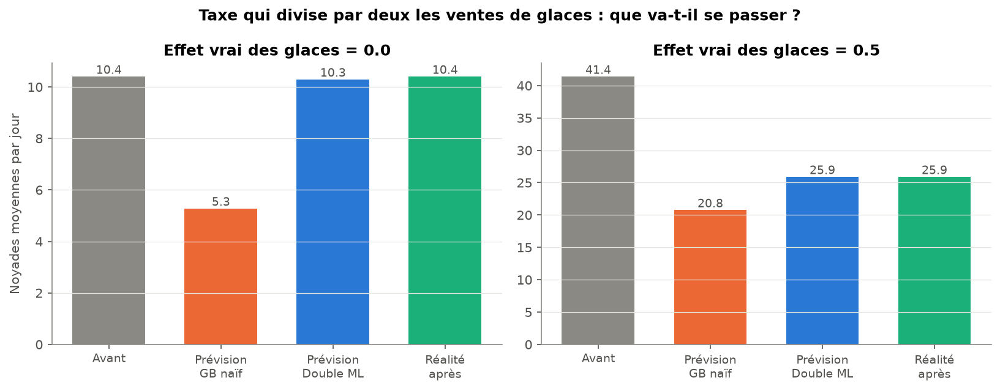
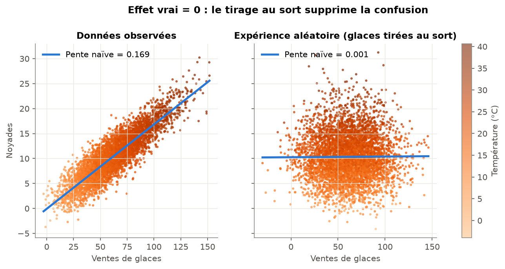
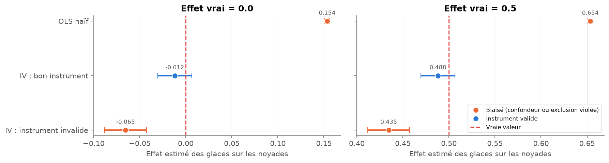
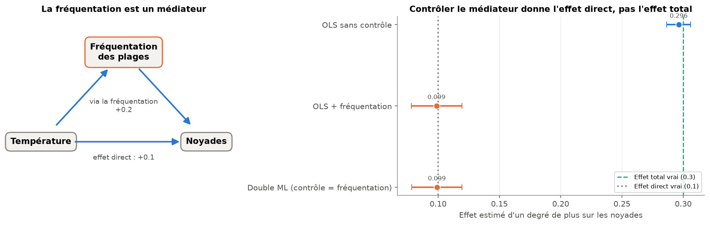
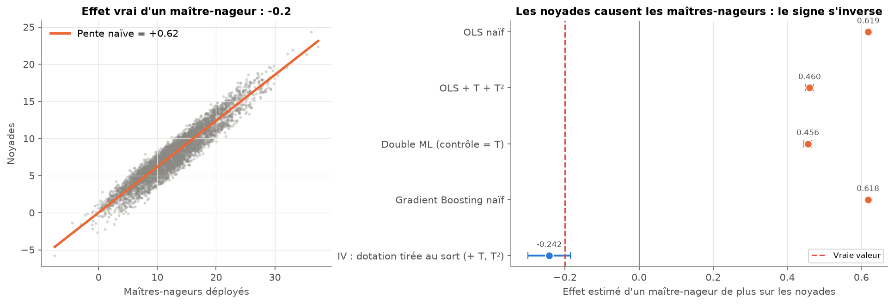

# Corrélation ≠ Causalité : prédire n'est pas expliquer


À partir de données **simulées dont on connaît la vérité**, ce projet montre qu'un modèle de machine learning peut
très bien prédire tout en donnant une mauvaise réponse causale, alors que le contrôle du confondeur (OLS bien
spécifié, Double ML) retrouve le vrai effet. La différence ne vient pas de l'algorithme mais de la question posée :
*prédire Y* n'est pas *mesurer l'effet de X sur Y*.

## 1. Régression fallacieuse : deux séries indépendantes « parfaitement liées »

Deux marches aléatoires indépendantes avec dérive (n = 100) :

| Spécification | Pente | t-stat | p-value | R² | Durbin-Watson |
|---|---|---|---|---|---|
| Niveaux | 0.90 | 39.3 | < 0.001 | **0.94** | 0.11 |
| Différences premières | 0.12 | 0.95 | 0.34 | 0.01 | 1.65 |

Le test ADF ne rejette pas la racine unitaire en niveaux (p = 1.00 et 0.12), mais la rejette en différences
(p < 0.001). Sur 500 simulations, la régression en niveaux est « significative » à 5 % dans **100 %** des cas,
contre **4.2 %** en différences. Sans dérive, ce taux passe de 50 % à 93 % quand n va de 25 à 1 000 : plus de
données n'aide pas.


**Faut-il toujours différencier ? Non.** Deux séries qui suivent la même tendance stochastique sont
**cointégrées**, et leur régression en niveaux est légitime. Le test d'Engle-Granger distingue les deux cas
(p = 0.82 pour la paire fallacieuse, p < 0.001 pour la paire cointégrée). Il n'est cependant pas parfait : sur
300 paires indépendantes, il en déclare 10 % cointégrées au lieu des 5 % attendus.


## 2. Le confondeur : glaces, noyades et température

La température cause à la fois les ventes de glaces et les noyades. Les glaces n'ont **aucun effet** sur les
noyades (n = 5 000).


Le Gradient Boosting naïf (noyades ~ glaces) **prédit bien** (R² = 0.78 en validation croisée) mais conclut
qu'une glace de plus cause 0.17 noyade.

| Méthode | Effet estimé (vrai = 0) | IC 95 % | Effet estimé (vrai = 0.5) | IC 95 % |
|---|---|---|---|---|
| Gradient Boosting naïf | 0.167 | – | 0.663 | – |
| OLS naïf | 0.169 | [0.167 ; 0.172] | 0.669 | [0.667 ; 0.672] |
| OLS + température + température² | 0.006 | [-0.005 ; 0.017] | 0.506 | [0.495 ; 0.517] |
| **Double ML (forêts aléatoires)** | **0.004** | **[-0.008 ; 0.015]** | **0.500** | **[0.488 ; 0.512]** |
| *Bonus : OLS + température sans le carré* | 0.047 | [0.037 ; 0.057] | 0.547 | [0.537 ; 0.557] |
| *Bonus : Gradient Boosting + température* | 0.015 | – | 0.505 | – |


## 3. Robustesse et limites du contrôle

| Question | Résultat |
|---|---|
| **Sur 100 simulations**, les estimateurs sont-ils fiables ? | OLS + T + T² : biais 0.001, couverture de l'IC 96 %. Double ML : biais 0.002, couverture **87 %** (IC un peu trop étroit). OLS naïf : couverture 0 %. |
| **Combien de données** pour le Double ML ? | Biais de 0.05 et couverture de 54 % à n = 200 ; fiable vers n = 2 000 (couverture 96 %). L'OLS bien spécifié est fiable dès n = 200. |
| Et si la température est **mal mesurée** ? | Le biais revient vite : 0.07 dès une erreur de 1 °C, 0.17 (= naïf) avec une erreur de 10 °C. |
| L'**importance des variables** est-elle causale ? | Non. Si la température est mal mesurée, les glaces deviennent la variable la plus importante (1.20 contre 0.04), alors que leur effet est nul. |
| Peut-on **contrôler trop** ? | Oui. Ajouter un collider (articles de presse, causés par les glaces et les noyades) crée un biais : -0.06 au lieu de 0, et 0.12 au lieu de 0.5. |


## 4. Agir sur le monde : intervention, expérience, instrument

**Une décision prise avec un modèle prédictif.** Une mairie envisage une taxe qui divise par deux les ventes de
glaces et demande au Gradient Boosting combien de noyades seront évitées. On simule le même monde après la taxe
pour connaître la réalité :

| Effet vrai | Noyades avant | Prévision du GB naïf | Prévision du Double ML | Réalité après la taxe |
|---|---|---|---|---|
| 0 | 10.4 | **5.3** | 10.3 | 10.4 |
| 0.5 | 41.4 | **20.8** | 25.9 | 25.9 |

Le modèle prédictif annonce des noyades divisées par deux alors que rien ne change, ou surestime la baisse
quand l'effet existe. Il répond à « combien de noyades les jours où l'on vend peu de glaces ? », pas à
« combien si l'on force les ventes à baisser ? ».



**L'expérience aléatoire.** Si les glaces sont tirées au sort, la simple régression naïve retrouve le vrai effet
(0.001 au lieu de 0, 0.501 au lieu de 0.5) : le tirage au sort coupe le lien avec la température.



**La variable instrumentale, quand la température n'est pas observée.** Une grève des livreurs, certains jours
tirés au hasard, fait baisser les ventes sans agir directement sur les noyades. Les doubles moindres carrés
retrouvent l'effet sans utiliser la température : -0.012 [-0.030 ; 0.006] pour un effet vrai de 0, et 0.488
[0.470 ; 0.506] pour 0.5. Mais un instrument faible (F de première étape = 0.6) donne un IC de [-1.5 ; 0.9], et un
instrument invalide (la grève touche aussi les maîtres-nageurs) donne -0.065 [-0.088 ; -0.042] : une conclusion
fausse qui a l'air solide.



## 5. Deux autres pièges : le médiateur et la causalité inverse

**Le médiateur.** La température agit sur les noyades directement (+0.1 par degré) et via la fréquentation des
plages (+0.2). Sans contrôle, l'OLS donne l'effet total (0.296) ; en contrôlant la fréquentation, il ne reste que
l'effet direct (0.099), et le Double ML fait de même (0.099). Contrôler un médiateur ne crée pas d'erreur de calcul,
mais change la question posée.

**La causalité inverse.** Les maîtres-nageurs réduisent les noyades (-0.2 par maître-nageur), mais les mairies en
déploient plus là où il y a des noyades. L'OLS naïf (+0.62), l'OLS avec la température (+0.46), le Double ML (+0.46)
et le Gradient Boosting (+0.62) concluent tous que les maîtres-nageurs **augmentent** les noyades. Seule une dotation
tirée au sort, utilisée comme instrument, retrouve le bon signe : -0.242 [-0.300 ; -0.185].




Les 24 figures sont dans [`figures/`](figures/).

## 6. Conclusion générale

### Deux questions différentes

Tout le projet repose sur une distinction : **prédire** (que va-t-il se passer si j'observe X ?) et **expliquer
pour agir** (que va-t-il se passer si je modifie X ?). La première se juge sur des données de test (R², validation
croisée). La seconde ne se juge pas avec les données seules : elle repose sur des hypothèses sur la façon dont les
données ont été produites. Aucune métrique de prédiction ne permet de vérifier une réponse causale.

### Bilan des méthodes

| Méthode | Question à laquelle elle répond | Hypothèse indispensable | Ce que le projet montre | Quand l'utiliser |
|---|---|---|---|---|
| Gradient Boosting (ML prédictif) | Prédire Y à partir de X | Le futur ressemble au passé | R² = 0.78, mais un « effet » de 0.17 au lieu de 0, et -49 % de noyades annoncés après une taxe sans effet | Prévoir, tant qu'on n'agit pas sur X |
| Importance des variables | Quelles variables aident à prédire ? | Aucune hypothèse causale | Les glaces deviennent la variable la plus importante alors que leur effet est nul | Comprendre un modèle, pas expliquer le monde |
| OLS naïf | Lien linéaire entre X et Y | Pas de confondeur | Biais de 0.17 avec un IC très étroit : couverture de 0 % | Décrire les données, jamais seul pour conclure |
| Tests ADF et Engle-Granger | Les séries sont-elles stationnaires ou cointégrées ? | Valeurs critiques approximatives en petit échantillon | Détectent la non-stationnarité qui produit 100 % de faux positifs en niveaux ; Engle-Granger déclare cointégrées 10 % des paires indépendantes | Avant toute régression sur des séries temporelles |
| OLS avec contrôles | Effet de X à confondeurs fixés | Tous les confondeurs observés et bien mesurés, bonne forme fonctionnelle | Sans biais et couverture de 96 % avec T² ; biais de 0.047 sans | Relations connues, petits échantillons |
| Double ML | Même question, sans imposer la forme fonctionnelle | Tous les confondeurs observés et bien mesurés, beaucoup de données | Retrouve 0 et 0.5 ; couverture de 87 % ; biaisé à n = 200 ; impuissant face à un confondeur mal mesuré ou un collider | Relations non linéaires ou nombreux contrôles, grands échantillons |
| Expérience aléatoire | Effet de X quand X est attribué au hasard | Tirage au sort respecté | La régression naïve devient sans biais | Dès qu'on peut expérimenter (A/B test) |
| Variable instrumentale | Effet de X à partir d'une source de variation externe | Pertinence (F > 10) et exclusion (non testable) | Retrouve l'effet sans observer la température, et le bon signe en cas de causalité inverse ; inutilisable si l'instrument est faible, faux s'il est invalide | Confondeur non observé ou causalité inverse, et instrument crédible |

### Le raisonnement compte plus que l'algorithme

- Le même Gradient Boosting donne une mauvaise réponse sur des données observées et une bonne sur une expérience
  aléatoire. Ce qui change, ce n'est pas l'algorithme, c'est la façon dont les données ont été produites.
- Les choix décisifs se font avant le code : quelle question on pose, quel est le schéma causal (confondeurs,
  colliders, médiateurs, instruments, sens des flèches), quelle stratégie d'identification est crédible. Ajouter des
  variables « au cas où » peut créer un biais (collider) ou changer la question posée (médiateur : effet direct au
  lieu de l'effet total), et une variable mal mesurée laisse un biais. Quand la causalité va dans les deux sens,
  aucun contrôle ne suffit : les maîtres-nageurs semblent augmenter les noyades alors qu'ils les réduisent.
- Une estimation précise n'est pas une estimation juste : l'OLS naïf, le collider et l'instrument invalide donnent
  tous des IC étroits autour d'une mauvaise valeur.

### Économétrie et machine learning sont complémentaires

- Le machine learning apporte la flexibilité : les forêts du Double ML apprennent seules l'effet non linéaire de la
  température. L'économétrie apporte l'identification et l'inférence : orthogonalisation, cross-fitting,
  intervalles de confiance, instruments, tests de stationnarité.
- Le Double ML combine les deux, mais il hérite aussi des limites des deux : il dépend des hypothèses
  d'identification comme l'OLS, et de la qualité des modèles de machine learning (biais à petit n, IC un peu trop
  étroits).

### Outils et coût

- numpy et pandas suffisent pour simuler ; statsmodels couvre l'économétrie (OLS, ADF, Engle-Granger, 2SLS) ;
  scikit-learn couvre le machine learning (Gradient Boosting, forêts aléatoires, importance par permutation) ;
  doubleml implémente le Double ML.
- Un OLS ou une 2SLS prennent quelques millisecondes, un Double ML quelques secondes. La différence devient sensible
  dès qu'on répète les estimations : les Monte Carlo du projet prennent environ 10 minutes.
- La simulation est le seul cadre où l'on connaît la vérité. C'est ce qui la rend utile pour comprendre et tester
  une méthode, et c'est aussi sa limite : elle ne valide pas une analyse sur des données réelles.

### En pratique : quatre questions avant de conclure

1. Est-ce que je veux prédire, ou savoir ce qui se passe si j'agis ?
2. Quel est le schéma causal : quels confondeurs, sont-ils observés et bien mesurés, y a-t-il des colliders ou des
   médiateurs à ne pas contrôler, la causalité peut-elle aller dans les deux sens ?
3. Quelle stratégie d'identification : expérience, contrôle des confondeurs (OLS ou Double ML), instrument ?
4. Comment vérifier : la méthode retrouve-t-elle un effet connu sur données simulées, le résultat résiste-t-il à un
   changement de contrôles, l'échantillon est-il assez grand ?

## 7. Limites

- Une simulation ne montre que ce qu'on y met : les résultats illustrent des mécanismes, ils ne prouvent rien
  sur des données réelles.
- Dans la vraie vie, on ne sait jamais avec certitude si tous les confondeurs sont observés, ni s'ils sont bien
  mesurés. Le Double ML ne corrige que la confusion due aux variables qu'on lui fournit, et un mauvais choix de
  contrôles (collider) crée un biais : le choix des variables relève du raisonnement causal, pas de l'algorithme.
- L'OLS dépend de la bonne forme fonctionnelle : sans le terme en température², il reste biaisé (0.047 au lieu de 0).
- Le Double ML a besoin de beaucoup de données, et ses intervalles de confiance sont un peu trop optimistes ici
  (couverture de 87 % au lieu de 95 %), car ses garanties sont asymptotiques.
- Une variable instrumentale ne vaut que par son hypothèse d'exclusion, qui ne se teste pas dans les données : elle
  doit être justifiée par le raisonnement.

## 8. Références

- Yule, G. U. (1926). Why do we sometimes get nonsense-correlations between time-series? *Journal of the Royal
  Statistical Society*, 89(1), 1–63.
- Granger, C. W. J. & Newbold, P. (1974). Spurious regressions in econometrics. *Journal of Econometrics*, 2(2), 111–120.
- Chernozhukov, V., Chetverikov, D., Demirer, M., Duflo, E., Hansen, C., Newey, W. & Robins, J. (2018).
  Double/debiased machine learning for treatment and structural parameters. *The Econometrics Journal*, 21(1), C1–C68.
- Pearl, J. (2009). *Causality: Models, Reasoning, and Inference* (2nd ed.). Cambridge University Press.

## 9. Installation et lancement (PowerShell)

```powershell
cd correlation-vs-causalite
python -m venv .venv
.\.venv\Scripts\Activate.ps1
pip install -r requirements.txt

jupyter notebook notebook.ipynb   # démonstration commentée (régénère les figures, environ 11 minutes)
python -m pytest                  # tests (moins d'une minute)
```

Organisation :

- `src/` : simulation, estimations et figures ;
- `notebook.ipynb` : la démonstration ;
- `notebooks/` : brouillons d'exploration (01 à 07), écrits avant de ranger le code dans `src/` ;
- `figures/` : images générées ;
- `tests/` : vérifications automatiques.

Toutes les seeds sont fixées : les résultats sont reproductibles.
