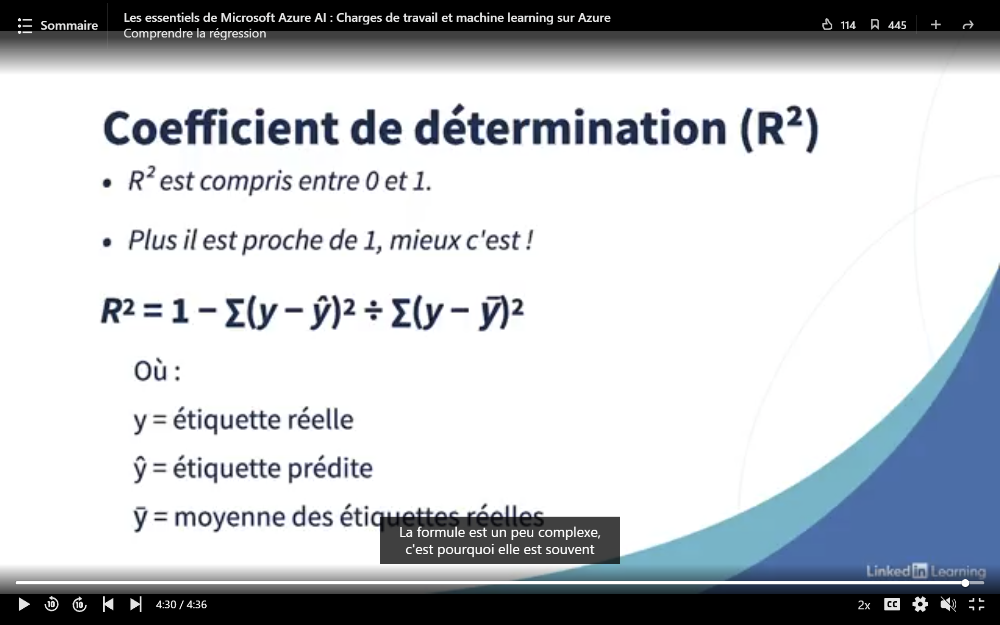

# Corrélation ≠ Causalité : prédire n'est pas expliquer


Ce projet part de données simulées, dont on connaît donc la vérité, pour montrer qu'un modèle de machine learning
peut très bien prédire et pourtant se tromper sur l'effet causal. Les méthodes qui tiennent compte du confondeur
(un OLS bien spécifié, le Double ML) retrouvent le vrai effet. La différence ne vient pas de l'algorithme mais de la
question : prédire Y, ce n'est pas mesurer l'effet de X sur Y.

**Confondeur** : variable qui influence à la fois la cause supposée X et le résultat Y. Elle crée une corrélation
entre X et Y même quand X n'a aucun effet sur Y. Dans ce projet, c'est la température : quand il fait chaud, on vend
plus de glaces et il y a plus de noyades, sans que les glaces y soient pour quelque chose.

Le détail (code commenté, 24 figures) est dans [`notebook.ipynb`](notebook.ipynb).

## 1. Deux séries sans lien, un R² de 0.94

Le site [Spurious Correlations](https://www.tylervigen.com/spurious-correlations) de Tyler Vigen rassemble des
corrélations absurdes trouvées dans des données publiques : le nombre de films avec Nicolas Cage suit le nombre de
noyades en piscine, la consommation de margarine suit le taux de divorce dans le Maine. Il les obtient en croisant un
très grand nombre de séries et en gardant les plus corrélées. Ce sont souvent de courtes séries annuelles qui
évoluent avec le temps, et cela suffit à produire une forte corrélation. Ses exemples ont aussi été réunis dans un
livre, *Spurious Correlations* (2015).

Le projet reproduit le phénomène avec deux marches aléatoires indépendantes (n = 100) :

| Spécification | Pente | t-stat | p-value | R² | Durbin-Watson |
|---|---|---|---|---|---|
| Niveaux | 0.90 | 39.3 | < 0.001 | 0.94 | 0.11 |
| Différences premières | 0.12 | 0.95 | 0.34 | 0.01 | 1.65 |

Un R² élevé est souvent présenté comme le but à atteindre, par exemple dans ce cours de LinkedIn Learning :



*Source : LinkedIn Learning, « Les essentiels de Microsoft Azure AI : Charges de travail et machine learning sur
Azure », vidéo « Comprendre la régression ».*

Pour juger une prédiction, c'est souvent vrai. Mais le R² ne dit rien de la cause : ici, un R² de 0.94 relie deux
séries qui n'ont rien à voir. Le test ADF montre qu'elles ne sont pas stationnaires (p = 1.00 et 0.12), ce qui rend les
statistiques usuelles de l'OLS invalides, et en différences premières le lien disparaît. Sur 500 simulations, la
régression en niveaux est « significative » dans 100 % des cas, contre 4.2 % en différences. Sans dérive, ce taux
passe de 50 % à 93 % quand n va de 25 à 1 000 : plus de données n'arrange rien.


Il ne faut pas pour autant différencier systématiquement. Deux séries qui suivent la même tendance stochastique sont
cointégrées, et leur régression en niveaux a un sens. Le test d'Engle-Granger sépare les deux cas (p = 0.82 pour la
paire fallacieuse, p < 0.001 pour une paire cointégrée), même s'il déclare cointégrées 10 % des paires indépendantes
au lieu de 5 %.

## 2. Le confondeur : glaces, noyades et température

La température fait monter à la fois les ventes de glaces et les noyades, et les glaces n'ont aucun effet sur les
noyades (n = 5 000). Le Gradient Boosting naïf (noyades ~ glaces) prédit bien, avec un R² de 0.78 en validation
croisée, mais il conclut qu'une glace de plus cause 0.17 noyade.


| Méthode | Effet vrai = 0 | IC 95 % | Effet vrai = 0.5 | IC 95 % |
|---|---|---|---|---|
| Gradient Boosting naïf | 0.167 | aucun | 0.663 | aucun |
| OLS naïf | 0.169 | [0.167 ; 0.172] | 0.669 | [0.667 ; 0.672] |
| OLS + température + température² | 0.006 | [-0.005 ; 0.017] | 0.506 | [0.495 ; 0.517] |
| Double ML (forêts aléatoires) | 0.004 | [-0.008 ; 0.015] | 0.500 | [0.488 ; 0.512] |
| OLS + température, sans le carré | 0.047 | [0.037 ; 0.057] | 0.547 | [0.537 ; 0.557] |
| Gradient Boosting + température | 0.015 | aucun | 0.505 | aucun |

Sans le terme au carré, l'OLS reste biaisé parce que la forme fonctionnelle est fausse. Le Gradient Boosting se
rapproche de 0 dès qu'on lui donne la température : le problème venait de la question qu'on lui posait, pas de
l'algorithme.


## 3. Robustesse et limites du contrôle

| Question | Résultat |
|---|---|
| Sur 100 simulations, les estimateurs sont-ils fiables ? | L'OLS avec T et T² a un biais de 0.001 et une couverture de 96 %. Le Double ML a un biais de 0.002, mais une couverture de 87 % (son IC est un peu trop étroit). L'OLS naïf couvre 0 % du temps. |
| Combien de données faut-il au Double ML ? | À n = 200, son biais vaut 0.05 et sa couverture 54 %. Il devient fiable vers n = 2 000. L'OLS bien spécifié l'est dès n = 200. |
| Et si la température est mal mesurée ? | Le biais revient vite : 0.07 avec une erreur de 1 °C, 0.17 (comme l'OLS naïf) avec une erreur de 10 °C. |
| L'importance des variables est-elle causale ? | Non. Avec une température mal mesurée, les glaces deviennent la variable la plus importante (1.20 contre 0.04) alors que leur effet est nul. |
| Peut-on contrôler trop ? | Oui. Contrôler un collider (des articles de presse causés par les glaces et par les noyades) crée un biais : -0.06 au lieu de 0, et 0.12 au lieu de 0.5. |


## 4. Agir sur le monde

Une mairie envisage une taxe qui divise par deux les ventes de glaces et demande au Gradient Boosting combien de
noyades elle évitera. Comme les données sont simulées, on connaît aussi le résultat réel :

| Effet vrai | Noyades avant | Prévision du GB naïf | Prévision du Double ML | Réalité après la taxe |
|---|---|---|---|---|
| 0 | 10.4 | 5.3 | 10.3 | 10.4 |
| 0.5 | 41.4 | 20.8 | 25.9 | 25.9 |

Le modèle annonce deux fois moins de noyades alors que rien ne change. Il répond à « combien de noyades les jours où
l'on vend peu de glaces ? », pas à « combien si l'on force les ventes à baisser ? ».


Quand on ne peut pas mettre le confondeur dans le modèle, deux solutions restent possibles. Si les glaces sont tirées
au sort (une expérience aléatoire), la régression naïve retrouve le vrai effet : 0.001 pour 0, 0.501 pour 0.5. Sinon,
on peut chercher un instrument : une grève des livreurs, certains jours tirés au hasard, fait baisser les ventes sans
agir directement sur les noyades, et la 2SLS retrouve l'effet sans observer la température (-0.012 [-0.030 ; 0.006]
pour 0, 0.488 [0.470 ; 0.506] pour 0.5). Un instrument faible (F = 0.6) donne un IC de -1.5 à 0.9. Un instrument
invalide (la grève touche aussi les maîtres-nageurs) donne -0.065 [-0.088 ; -0.042], une conclusion fausse qui a
l'air solide.


## 5. Le médiateur et la causalité inverse

La température agit sur les noyades directement (+0.1 par degré) et en attirant du monde sur les plages (+0.2). Sans
contrôle, l'OLS donne l'effet total (0.296). En contrôlant la fréquentation, il ne reste que l'effet direct (0.099), et
le Double ML donne la même chose. Contrôler un médiateur ne produit pas d'erreur de calcul, mais change la question.

Les maîtres-nageurs réduisent les noyades (-0.2 par maître-nageur), mais les mairies en envoient davantage là où il y
a des noyades. L'OLS naïf (+0.62), l'OLS avec la température (+0.46), le Double ML (+0.46) et le Gradient Boosting
(+0.62) concluent tous que les maîtres-nageurs augmentent les noyades. Seule une dotation tirée au sort, utilisée
comme instrument, retrouve le bon signe : -0.242 [-0.300 ; -0.185].


## 6. Conclusion

Prédire, c'est répondre à « que va-t-il se passer si j'observe X ? ». Expliquer pour agir, c'est répondre à « que
va-t-il se passer si je modifie X ? ». La première question se juge sur des données de test. La seconde dépend
d'hypothèses sur la façon dont les données ont été produites, et aucune métrique de prédiction ne les vérifie.

| Méthode | Question à laquelle elle répond | Hypothèse indispensable | Ce que le projet montre | Quand l'utiliser |
|---|---|---|---|---|
| Gradient Boosting (ML prédictif) | Prédire Y à partir de X | Le futur ressemble au passé | R² = 0.78, mais un « effet » de 0.17 au lieu de 0, et -49 % de noyades annoncés après une taxe sans effet | Prévoir, tant qu'on n'agit pas sur X |
| Importance des variables | Quelles variables aident à prédire ? | Aucune hypothèse causale | Les glaces deviennent la variable la plus importante alors que leur effet est nul | Comprendre un modèle, pas expliquer le monde |
| OLS naïf | Lien linéaire entre X et Y | Pas de confondeur | Biais de 0.17 avec un IC très étroit : couverture de 0 % | Décrire les données, jamais seul pour conclure |
| Tests ADF et Engle-Granger | Les séries sont-elles stationnaires ou cointégrées ? | Valeurs critiques approximatives en petit échantillon | Détectent la non-stationnarité qui produit 100 % de faux positifs en niveaux ; Engle-Granger déclare cointégrées 10 % des paires indépendantes | Avant toute régression sur des séries temporelles |
| OLS avec contrôles | Effet de X à confondeurs fixés | Tous les confondeurs observés et bien mesurés, bonne forme fonctionnelle | Sans biais et couverture de 96 % avec T² ; biais de 0.047 sans | Relations connues, petits échantillons |
| Double ML | Même question, sans imposer la forme fonctionnelle | Tous les confondeurs observés et bien mesurés, beaucoup de données | Retrouve 0 et 0.5 ; couverture de 87 % ; biaisé à n = 200 ; impuissant face à un confondeur mal mesuré ou un collider | Relations non linéaires ou nombreux contrôles, grands échantillons |
| Expérience aléatoire | Effet de X quand X est attribué au hasard | Tirage au sort respecté | La régression naïve devient sans biais | Dès qu'on peut expérimenter (A/B test) |
| Variable instrumentale | Effet de X à partir d'une source de variation externe | Pertinence (F > 10) et exclusion (non testable) | Retrouve l'effet sans observer la température, et le bon signe en cas de causalité inverse ; inutilisable si l'instrument est faible, faux s'il est invalide | Confondeur non observé ou causalité inverse, et instrument crédible |

Le même Gradient Boosting se trompe sur les données observées et voit juste sur l'expérience aléatoire : entre les
deux, seule la façon dont les données ont été produites a changé. Les choix qui comptent se font donc avant le code
(la question, le schéma causal, la stratégie d'identification). Un IC étroit ne garantit rien non plus : l'OLS naïf,
le collider et l'instrument invalide donnent tous des intervalles serrés autour d'une mauvaise valeur. Le notebook
développe ces points, ainsi que ce que l'économétrie et le machine learning apportent chacun.

Avant de conclure à un effet, quatre questions :

1. Est-ce que je veux prédire, ou savoir ce qui se passe si j'agis ?
2. Quel est le schéma causal : quels confondeurs, sont-ils observés et bien mesurés, y a-t-il des colliders ou des
   médiateurs à ne pas contrôler, la causalité peut-elle aller dans les deux sens ?
3. Quelle stratégie d'identification : expérience, contrôle des confondeurs (OLS ou Double ML), instrument ?
4. Comment vérifier : la méthode retrouve-t-elle un effet connu sur données simulées, le résultat résiste-t-il à un
   changement de contrôles, l'échantillon est-il assez grand ?

## 7. Limites

- Une simulation ne montre que ce qu'on y met : elle illustre des mécanismes, elle ne valide pas une analyse sur des
  données réelles.
- On ne sait jamais avec certitude si tous les confondeurs sont observés et bien mesurés. Le Double ML ne corrige que
  la confusion due aux variables qu'on lui donne.
- L'OLS dépend de la bonne forme fonctionnelle : sans le terme en température², il trouve 0.047 au lieu de 0.
- Le Double ML a besoin de beaucoup de données, et ses IC sont un peu trop étroits ici (87 % de couverture au lieu
  de 95 %), car ses garanties sont asymptotiques.
- L'hypothèse d'exclusion d'un instrument ne se teste pas dans les données. Il faut la justifier par le raisonnement.

## 8. Références

- Yule, G. U. (1926). Why do we sometimes get nonsense-correlations between time-series? *Journal of the Royal
  Statistical Society*, 89(1), 1-63.
- Granger, C. W. J. & Newbold, P. (1974). Spurious regressions in econometrics. *Journal of Econometrics*, 2(2), 111-120.
- Chernozhukov, V., Chetverikov, D., Demirer, M., Duflo, E., Hansen, C., Newey, W. & Robins, J. (2018).
  Double/debiased machine learning for treatment and structural parameters. *The Econometrics Journal*, 21(1), C1-C68.
- Pearl, J. (2009). *Causality: Models, Reasoning, and Inference* (2nd ed.). Cambridge University Press.
- Vigen, T. (2015). *Spurious Correlations*. Site : https://www.tylervigen.com/spurious-correlations

## 9. Installation et lancement (PowerShell)

```powershell
cd correlation-vs-causalite
python -m venv .venv
.\.venv\Scripts\Activate.ps1
pip install -r requirements.txt

jupyter notebook notebook.ipynb   # démonstration commentée (régénère les figures, environ 11 minutes)
python -m pytest                  # tests (moins d'une minute)
```

Le code est dans `src/` (simulation, estimations, figures) et les tests dans `tests/`. Le dossier `notebooks/`
contient les brouillons d'exploration (01 à 07), écrits avant de ranger le code dans `src/`. Toutes les seeds sont
fixées, donc les résultats sont reproductibles.
